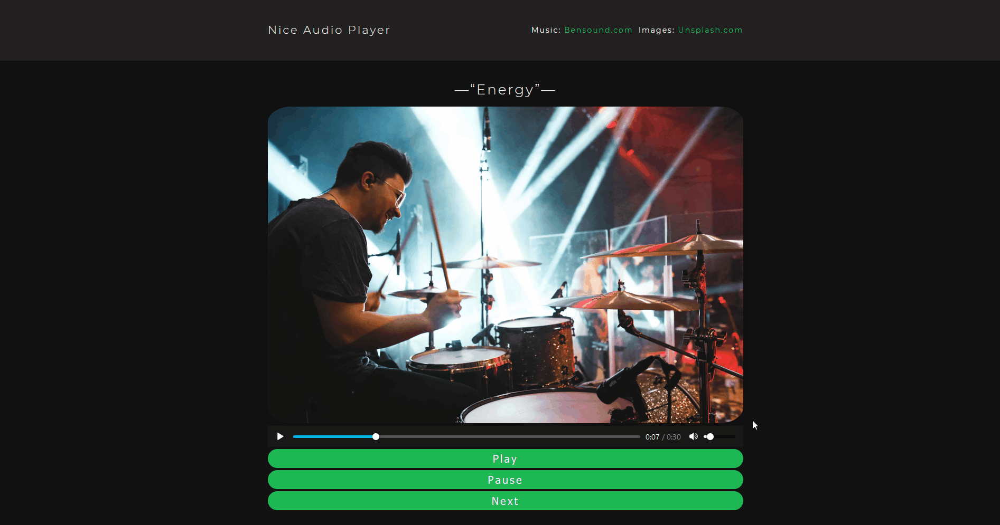

# nice-player

React Nice Audioplayer  - **Live Demo Link** https://niceplayer.netlify.app/

### Rationale for building the app:

I love music so I decided to develop a nice react audio player.

### List of App's Functionality:

- Using external library 'reactplayer'
- Conditional rendering
- Display different image and title preview on state change
- Play music
- Audio control buttons

### Instructions for Deploying the App Locally:

- Clone or download the repo
- Navigate the folder with the commnd line
- npm install
- npm start
- Made with Create React App
